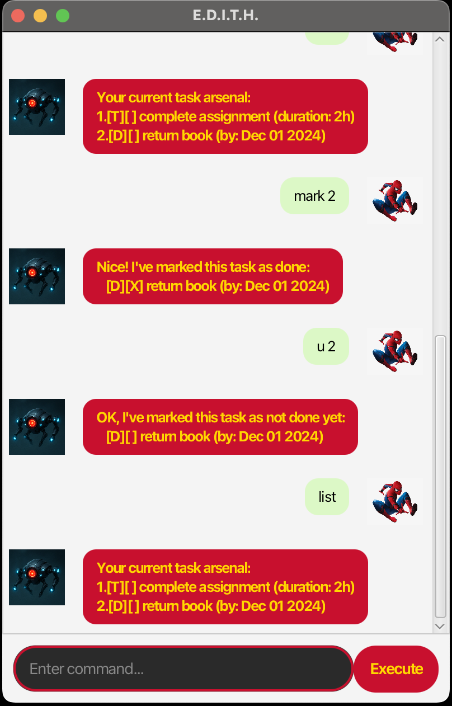

# E.D.I.T.H. User Guide

E.D.I.T.H. (Enhanced Digital Interactive Task Helper) is a desktop application for managing your tasks, optimized for use via a Command Line Interface (CLI) while still having the benefits of a Graphical User Interface (GUI). If you can type fast, E.D.I.T.H. can get your task management done faster than traditional GUI apps.

## Viewing all tasks: `list`
Display all tasks saved in order of insertion.

**Format:** `list`

**Alias:** `l`

## Adding Todo: `todo`
Adds a todo task to the task list.

**Format:** `todo TASKNAME`

**Format with duration:** `todo TASKNAME /duration DURATION`

**Alias:** `t`

**Examples:**
- `todo read book`
- `todo complete assignment /duration 2h`

**Duration formats:**
- `30` (30 minutes)
- `1h` (1 hour)
- `1h30m` (1 hour 30 minutes)
- `2.5h` (2.5 hours)

## Adding Deadline: `deadline`
Adds a deadline task to the task list.

**Format:** `deadline TASKNAME /by DATETIME`

**Alias:** `d`

**Supported date formats:**
- `yyyy-mm-dd` (e.g., 2024-12-25)
- `d/m/yyyy HHmm` (e.g., 25/12/2024 1430)

**Example:** `deadline return book /by 2024-12-01`

## Adding Event: `event`
Adds an event task to the task list.

**Format:** `event TASKNAME /from DATETIME /to DATETIME`

**Alias:** `e`

**Supported date formats:**
- `yyyy-mm-dd` (e.g., 2024-12-25)
- `d/m/yyyy HHmm` (e.g., 25/12/2024 1430)

**Example:** `event project meeting /from 25/12/2024 1400 /to 25/12/2024 1600`

## Marking a task: `mark`
Marks a task as completed.

**Format:** `mark INDEX`

**Alias:** `m`

**Example:** `mark 1`

## Unmarking a task: `unmark`
Unmarks a task as incomplete.

**Format:** `unmark INDEX`

**Alias:** `u`

**Example:** `unmark 1`

## Deleting a task: `delete`
Deletes the specified task from the task list.

**Format:** `delete INDEX`

**Alias:** `del`

**Example:** `delete 1`

## Locating a task: `find`
Finds tasks whose task description contains the given keyword.

**Format:** `find KEYWORD`

**Alias:** `f`

**Example:** `find book`

⚠️ **Notes:**
- The search is case-insensitive
- Only task descriptions are searched
- Partial words can be matched

## Adding notes to tasks: `note`
Adds or updates a note for a specific task.

**Format:** `note INDEX NOTE_TEXT`

**Example:** `note 2 remember to bring laptop`

## Exiting the program: `bye`
Exits the program.

**Format:** `bye`

**Aliases:** `exit`, `quit`, `q`

## Command Aliases Summary
E.D.I.T.H. supports short aliases for faster typing:
- `t` → `todo`
- `d` → `deadline`
- `e` → `event`
- `l` → `list`
- `m` → `mark`
- `u` → `unmark`
- `del` → `delete`
- `f` → `find`
- `exit`, `quit`, `q` → `bye`

## Saving of data
Task list data is saved to the hard disk automatically after each command that changes the data. There is no need to save manually.

## Editing of the data file
Task list data is saved automatically as a JSON file `[JAR file location]/data/taskStorage.json`. Advanced users are welcome to update data directly by editing that data file.

⚠️ **Caution:** Be careful when modifying manually as invalid data will be ignored.
